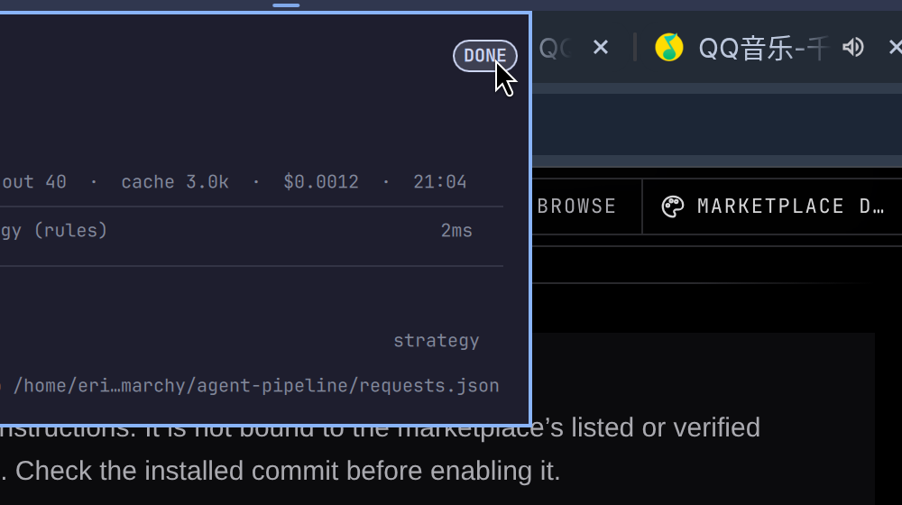

# Agent Pipeline — see what your AI agent is actually doing

An Omarchy bar widget that renders **one pipeline per agent request**: how the
request was classified, which model tier it was routed to, what memory was
retrieved, which tools ran, and whether the result was verified — with timing,
tokens and cost.

It exists for two audiences:

- **Operators**, who want to know why an answer cost what it cost.
- **Teachers and customers**, who want to *watch* an agent work instead of being
  told it does. The panel is the picture you point at while explaining
  "classify → route → retrieve → act → verify".



## How it gets data

The plugin never calls a model and never talks to the network. It reads one file:

```
$XDG_STATE_HOME/omarchy/agent-pipeline/requests.json      # usually ~/.local/state/...
```

```json
{
  "updatedAt": "2026-10-01T12:31:04Z",
  "requests": [
    {
      "id": "req-42",
      "at": "2026-10-01T12:31:04Z",
      "title": "定价策略评审",
      "agent": "entrepreneur-agent",
      "state": "done",
      "taskClass": "strategy",
      "route": "strong",
      "model": "zai/glm-5.3-highspeed",
      "tokens": { "input": 1240, "output": 96, "cacheRead": 4180, "costUsd": 0.0023 },
      "steps": [
        { "name": "classify", "status": "ok", "detail": "strategy (rules)", "ms": 2 },
        { "name": "route",    "status": "ok", "detail": "strong → glm-5.3-highspeed", "ms": 1 },
        { "name": "memory",   "status": "ok", "detail": "5 items retrieved", "ms": 130 },
        { "name": "model",    "status": "ok", "detail": "glm-5.3-highspeed", "ms": 8100 },
        { "name": "verify",   "status": "ok", "detail": "telemetry recorded", "ms": 3 }
      ]
    }
  ]
}
```

`steps[].status` accepts `ok`, `warn`, `error`, `running`, `skipped`.
`state` accepts `running`, `done`, `error`. Everything else is free text.

## Recording a request

The bundled writer keeps the file tidy (atomic writes, a lock, most recent 30
requests) and never fails loudly, so instrumentation cannot break the agent it
observes:

```bash
agent-pipeline start --id "$REQ" --title "定价策略评审" --agent entrepreneur-agent
agent-pipeline step  --id "$REQ" --name classify --status ok --detail "strategy (rules)" --ms 2
agent-pipeline step  --id "$REQ" --name memory   --status ok --detail "5 items retrieved" --ms 130
agent-pipeline step  --id "$REQ" --name model    --status ok --detail "glm-5.3-highspeed" --ms 8100
agent-pipeline end   --id "$REQ" --state done \
  --tokens-json '{"input":1240,"output":96,"cacheRead":4180,"costUsd":0.0023}'
```

Other subcommands: `emit --json '<object>'` (complete request in one call),
`clear`, `demo` (write a sample pipeline for a first look).

## Interaction

| action | result |
|---|---|
| left click | open the pipeline panel |
| middle click | reload the data file |
| right click | close the panel |
| `omarchy-shell shell summon io.github.ericyhm80.agent-pipeline '{}'` | open from a script |
| `omarchy-shell shell hide io.github.ericyhm80.agent-pipeline` | close from a script |

The bar glyph turns accent-coloured while a request is running, and urgent when
the newest request errored or a step reported a warning.

## Install

```bash
omarchy plugin add https://github.com/ericyhm80/omarchy-agent-pipeline --enable
omarchy plugin enable io.github.ericyhm80.agent-pipeline --section center
agent-pipeline demo        # see it with sample data
```

## Privacy

The widget only reads the local state file above. It makes no network requests,
collects nothing, and sends nothing anywhere. Whatever your agent writes into
that file is what you see.

## Uninstall

```bash
omarchy plugin remove io.github.ericyhm80.agent-pipeline
rm -f ~/.local/bin/agent-pipeline
rm -rf ~/.local/state/omarchy/agent-pipeline
```

## License

MIT — see [LICENSE](LICENSE).
